### Evidences of configuration of Repository in GitHub
## Github repo screenshots.
 -  Adding rules for branch protection
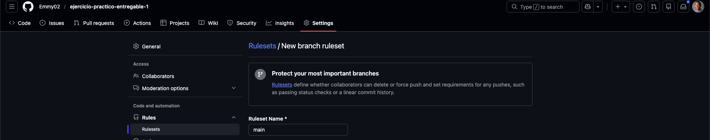

 -  Protecting main branch
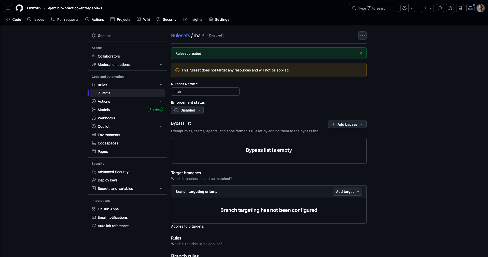

 -  Making sure only way to contribute or merge to main is via Pull Request, these PRs do not need to be reviewed or validating by anyone at this particular time.
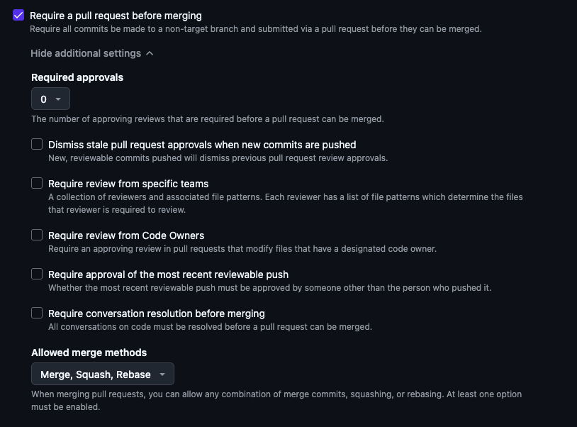

### Explanation of the configuration of the repository
 - It is always a good practice to protect as much as possible the main branch, because in real world this branch is usually conected to a production pipeline, so we need to make sure that we do not introduce any breaking changes to the code.
 - In this particular case, we are not requiring any one to review our PRs in order to be merged into `main` but, usually that is a great practice that enforces team colaboration and better comunication.

## Git Ignore
 - By using the `*` as prefix we are telling git to ignore any file that ends with `.log` or any directory that is named `__pycache__`.
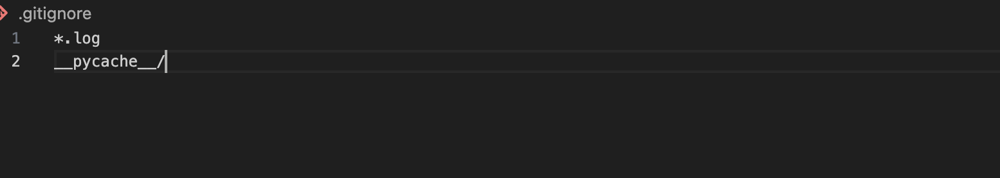
 - As we can see, there is a `test.log` file that is clearly being ignore.

## Link to repo
[Link to repo](https://github.com/Emmy02/ejercicio-practico-entregable-1)

## Link to workflow
[Link to workflow](https://github.com/Emmy02/ejercicio-practico-entregable-1/actions/workflows/demo.yml)

## Conflict solving
- As we can see, there is a conflict between the `main` branch and the `feature/resta` branch.
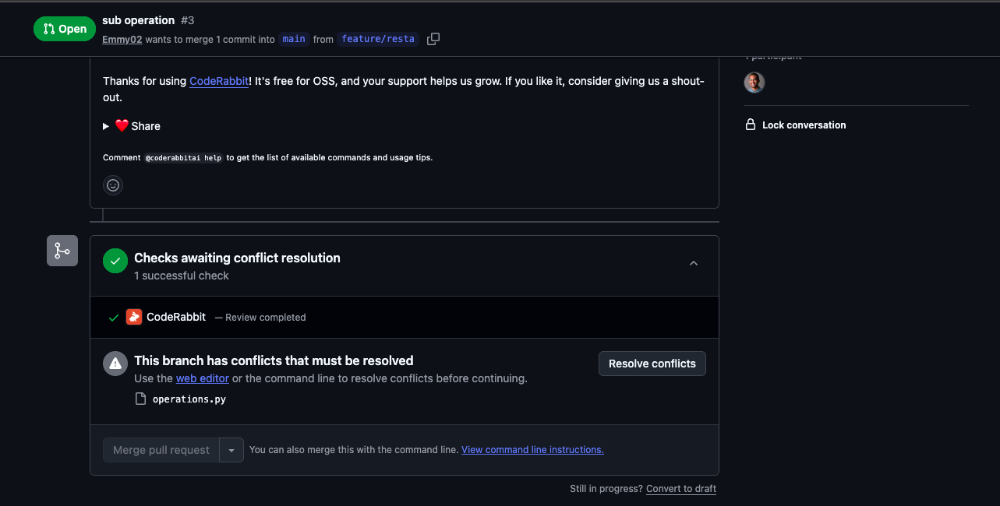

- Here we see the same conflict but in local.
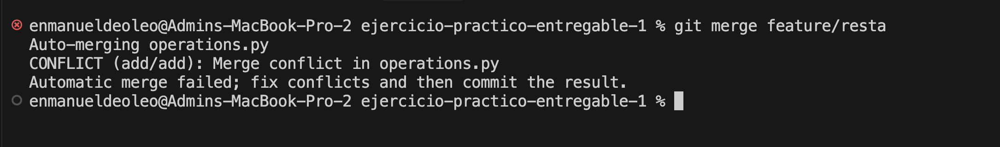

- Here we can see that we can choose to keep both changes. That was the aproach we took.
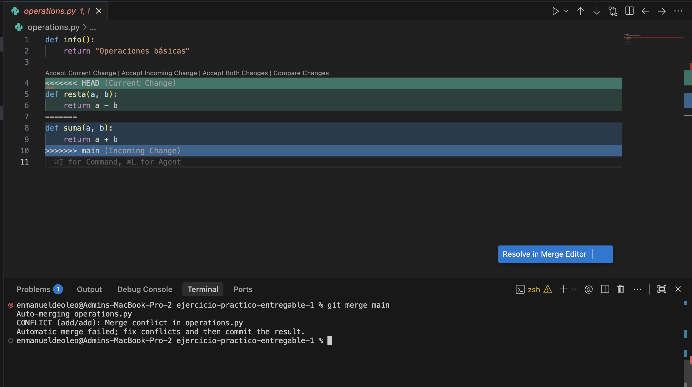

- Here is a clear evidence that the conflict was solved.
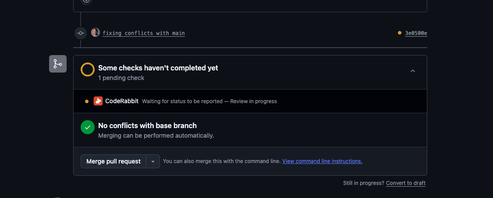

## Workflow explanation
- Workflow is a set of instructions that will be executed by GitHub Actions. And can be useful for automating tasks like testing, building, deploying, etc.

-  We have created a workflow called `Greet User` that will run a simple script that will print the name of the user.
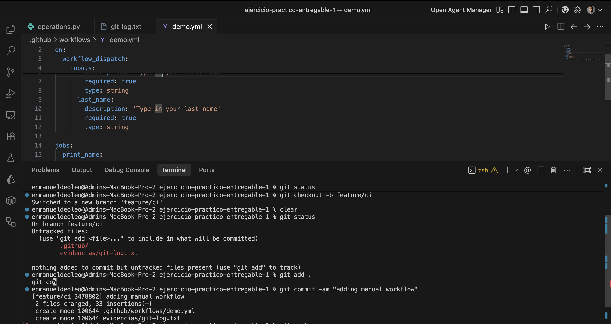

-  Here we can see the output of the workflow.
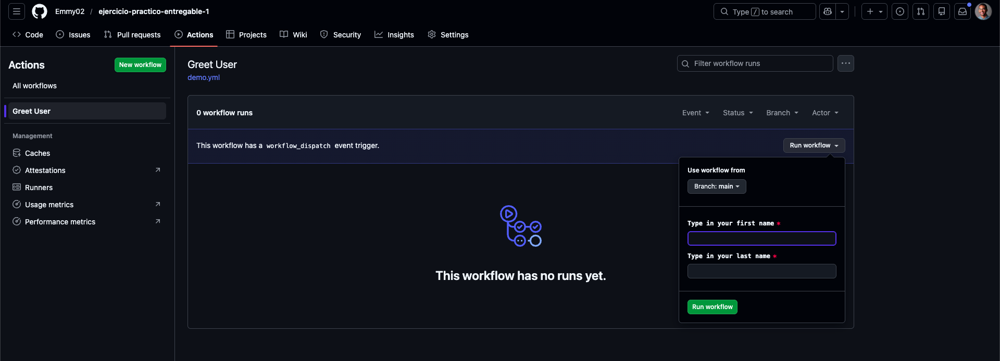
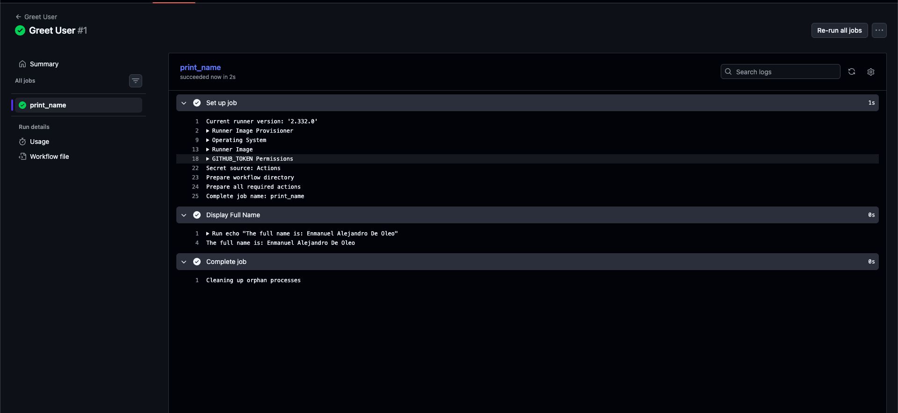